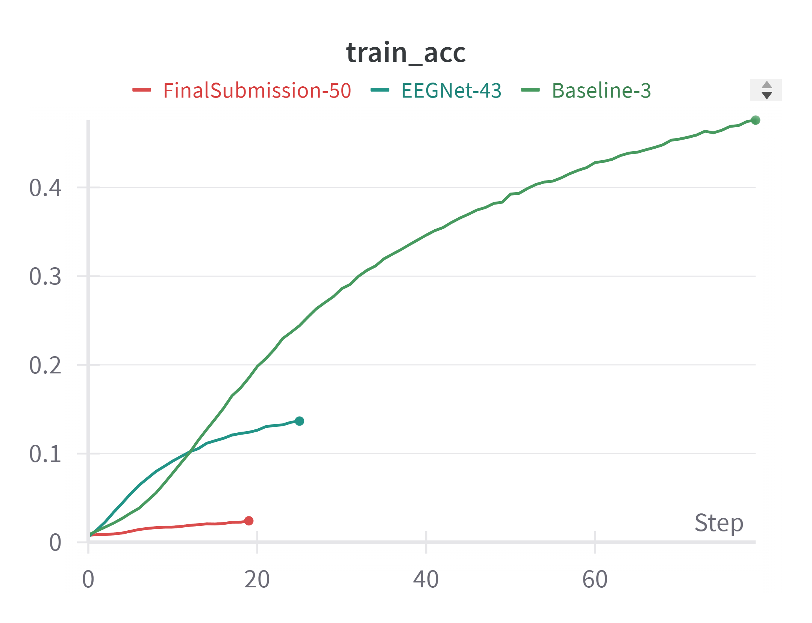
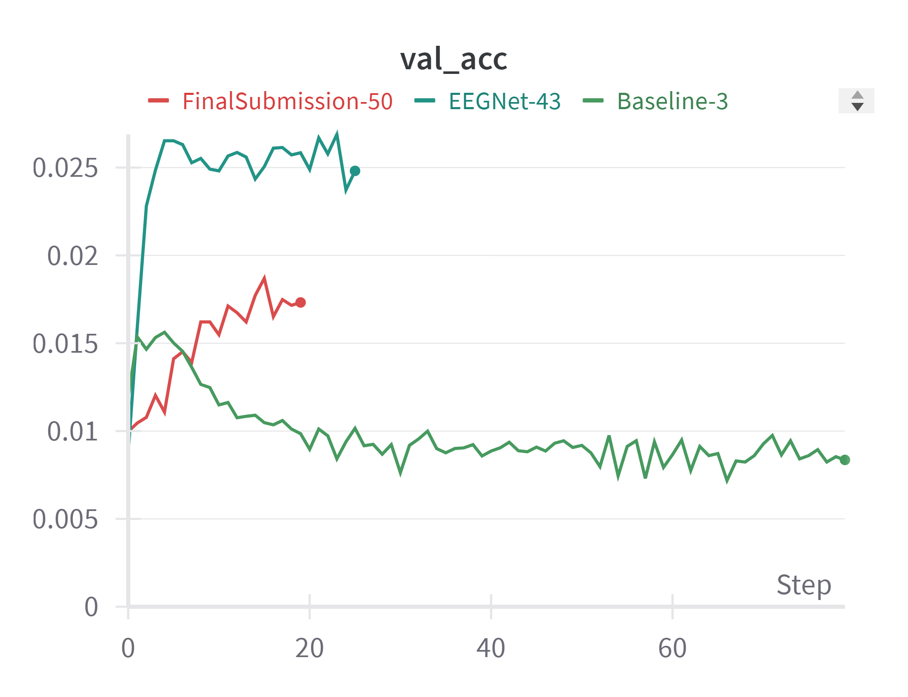
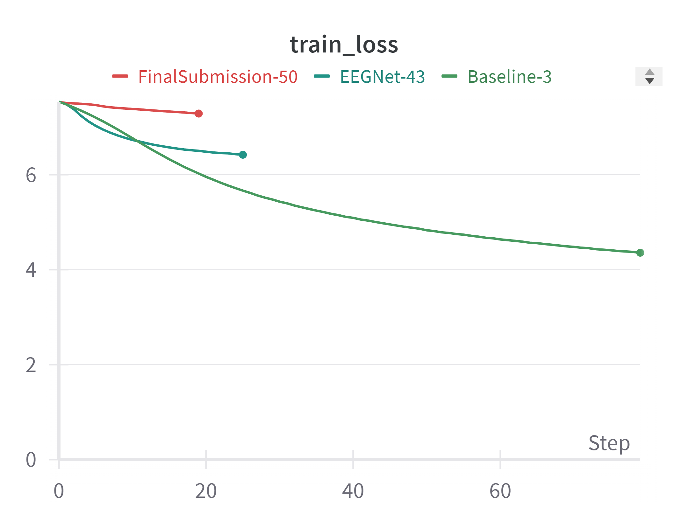
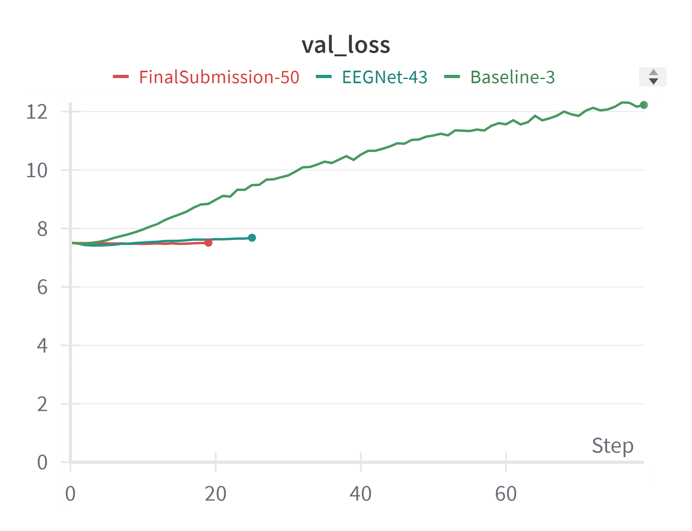

# 実装で工夫した点

ベースラインのコードに修正を加え、以下の３点を改善した。

- データの前処理
- 過学習対策
- ニューラルネットワークの構造

これにより、以下のグラフのようにベースラインのコードに比べ精度が改善した。参考にEEGNetを用いた場合の性能も調べてみたが、これには及ばなかった。





図：`FinalSubmission-50`:今回提出するコードの実行結果、`EEGNet-43`:TorchEEGのEEGNet(<https://github.com/torcheeg/torcheeg/blob/9c2c2dd333ca5a92ea7d255dc07a9525d2df803f/torcheeg/models/cnn/eegnet.py>)を適用した場合の結果、`Baseline-3`:ベースラインのコードの実行結果

## データの前処理

データの前処理ではベースラインの補正を行った。具体的には、281あるサンプリングポイントのうち最初の30点の平均値を差し引くことにした。

```diff
def forward(self, X: torch.Tensor) -> torch.Tensor:
    """_summary_
    Args:
        X ( b, c, t ): _description_
    Returns:
        X ( b, num_classes ): _description_
    """
+   # baseline correction
+   X -= X[:, :, :30].mean(dim=2, keepdim=True)

    X = self.blocks(X)

    return self.head(X)
```

## 過学習対策

ベースラインのコードではTrainの精度とValidationの精度の変化に大きな乖離があるなど過学習が発生していたため、過学習対策としてドロップアウト率を0.1から0.4に増やした。

## ニューラルネットワークの構造

山下隆義（2018）『イラストで学ぶディープラーニング』、講談社 には畳み込みニューラルネットワークの畳み込み層を追加する際、フィルタ数を一定にするよりも増加させる方が精度の改善が望める旨の記載があったので、それを実行した。また、畳み込み層の数を増やした。

```diff
        self.blocks = nn.Sequential(
-            ConvBlock(in_channels, hid_dim),
-            ConvBlock(hid_dim, hid_dim),
+            NewConvBlock(in_channels, hid_dim, p_drop=0.4),
+            NewConvBlock(hid_dim, hid_dim * 2, p_drop=0.4),
+            NewConvBlock(hid_dim * 2, hid_dim * 2, p_drop=0.4),
+            NewConvBlock(hid_dim * 2, hid_dim * 3, p_drop=0.4),
+            NewConvBlock(hid_dim * 3, hid_dim * 3, p_drop=0.4),
+            NewConvBlock(hid_dim * 3, hid_dim * 4, p_drop=0.4),
        )
```
